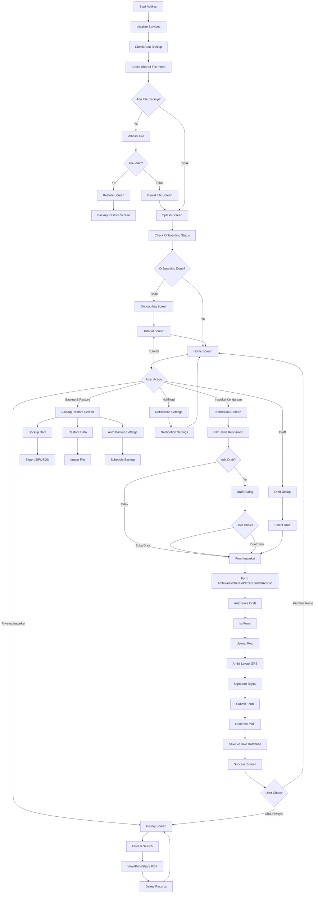
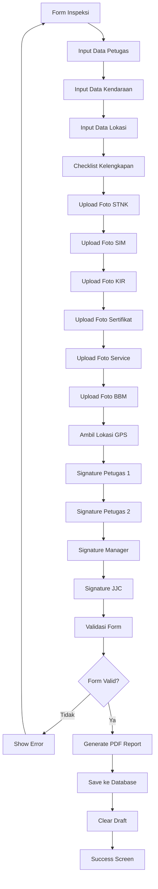
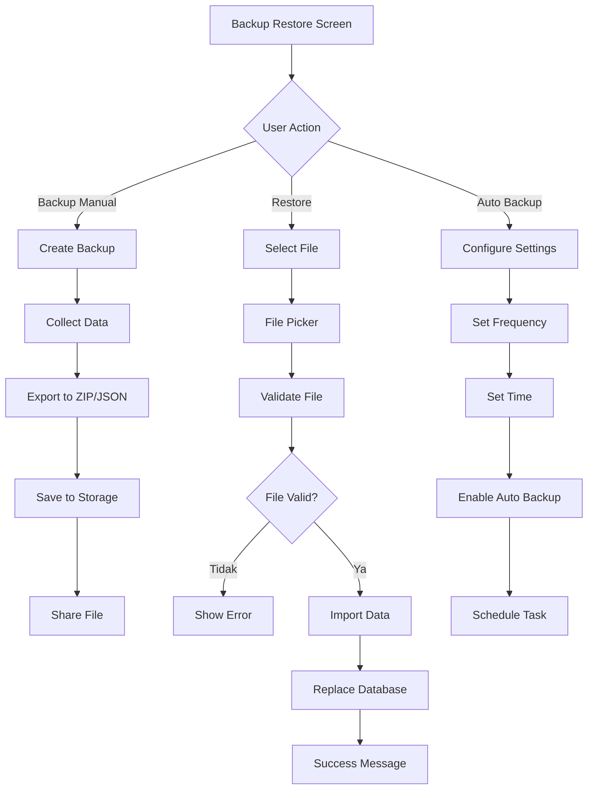
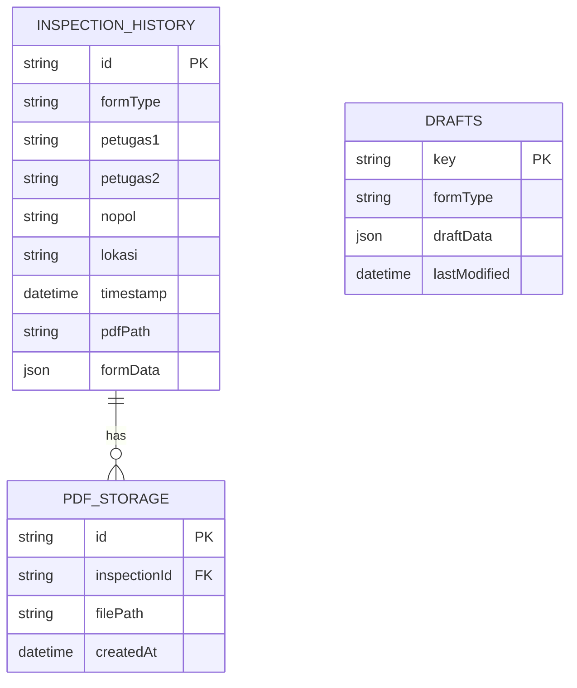

# FLOWCHART APLIKASI JJC OPERASIONAL

## Alur Kerja Utama Aplikasi

## Detail Alur Form Inspeksi

## Alur Backup & Restore

## Struktur Database

## Fitur Utama Aplikasi

### 1. **Inspeksi Kendaraan**
- 5 jenis kendaraan: Ambulance, Derek, Plaza, Kamtib, Rescue
- Form inspeksi lengkap dengan checklist
- Upload foto bukti (STNK, SIM, KIR, dll)
- GPS location tracking
- Digital signature
- Auto-save draft

### 2. **Riwayat Inspeksi**
- View semua data inspeksi
- Filter berdasarkan tanggal dan jenis kendaraan
- Search functionality
- Print/Share PDF reports
- Delete records
- Statistics dan charts

### 3. **Backup & Restore**
- Manual backup (ZIP/JSON format)
- Auto backup dengan jadwal
- Restore dari file
- Share backup files
- Import dari file intent

### 4. **Draft Management**
- Auto-save setiap 30 detik
- Resume draft yang tersimpan
- Multiple draft support
- Draft conflict resolution

### 5. **PDF Generation**
- Generate laporan PDF otomatis
- Include foto dan signature
- Professional layout
- Print dan share functionality

## Teknologi yang Digunakan

- **Framework**: Flutter
- **Database**: Hive (Local NoSQL)
- **PDF**: pdf package
- **Image**: image_picker
- **Location**: geolocator
- **Signature**: signature package
- **Storage**: path_provider, file_picker
- **Share**: share_plus
- **Print**: printing package
- **Charts**: fl_chart
- **Notifications**: flutter_local_notifications

## Alur Data

1. **Input** → Form inspeksi dengan validasi
2. **Processing** → Auto-save draft, generate PDF
3. **Storage** → Hive database (local)
4. **Output** → PDF report, backup files
5. **Sharing** → Print, share, export

## Keamanan & Backup

- Data tersimpan lokal di Hive database
- Auto-backup dengan jadwal yang dapat dikonfigurasi
- Manual backup/restore functionality
- File sharing untuk transfer data antar device
- Draft management untuk mencegah kehilangan data
